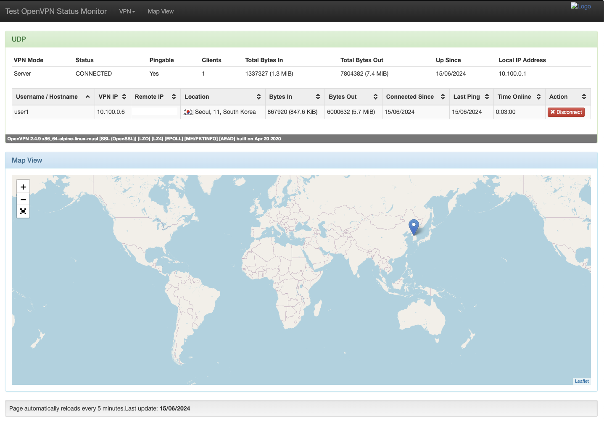

# VPN Server

## Terraform

### 1. Setup Allow cidr
```bash
export TF_VAR_allowed_cidr_blocks="[\"$(curl -s https://ifconfig.me/)/32\"]"
```

### 2. create ssh key
```bash
./scripts/gen_key.sh
```


### 3. create vpn instance
```bash
cd ./terraform/vpn
terrform init
terrform apply
```


## Docker

위에서 생성한 EC2에 접속 후 이후 단계를 진행한다.
> SSH 키는 ec2를 만들때 생성해두었음으로 해당키를 사용하여 접속한다.

```bash
pwd # ~/examples/vpn-server
ssh -i ssh/vpn-ec2-keypair ubuntu@${EC2_PUB_IP}


cd ./examples/vpn-server/docker
```


```bash
./scripts/init.sh

# 1. passpharse 설정 (ex: 1234)
# Enter New CA Key Passphrase:

# 2. Common Name 설정 (ex: ccrayz)
# Generating RSA private key, 4096 bit long modulus (2 primes)
# ......................................................................++++
# .........................................................................................++++
# e is 65537 (0x010001)
# You are about to be asked to enter information that will be incorporated
# into your certificate request.
# What you are about to enter is what is called a Distinguished Name or a DN.
# There are quite a few fields but you can leave some blank
# For some fields there will be a default value,
# If you enter '.', the field will be left blank.
# -----
# Common Name (eg: your user, host, or server name) [Easy-RSA CA]:

# 3. 지정한 passpharse 입력
# - 1번에서 생성한 pass 입력
```

해당 경로에 관련 파일들이 생성된것을 확인할 수 있다.
```bash
ls /mnt/vpn/
```

### IP 포워딩 설정
```bash
sudo vi /etc/sysctl.conf

# 설정
net.ipv4.ip_forward=1

# /etc/sysctl.conf 파일에서 설정 적용
sudo sysctl -p

# 서버 재시작
sudo reboot
```


### IP Table 설정
```bash
# NAT 설정
sudo iptables -t nat -A POSTROUTING -s 10.100.0.0/16 -o ens5 -j MASQUERADE
# 포워딩 규칙 설정
sudo iptables -A FORWARD -i tun0 -o ens5 -j ACCEPT
sudo iptables -A FORWARD -i ens5 -o tun0 -m state --state RELATED,ESTABLISHED -j ACCEPT
```

### vpn 서버 실행
```bash
pwd # examples/vpn-server/docker
docker compose up -d
```

### VPN monitor 접속


